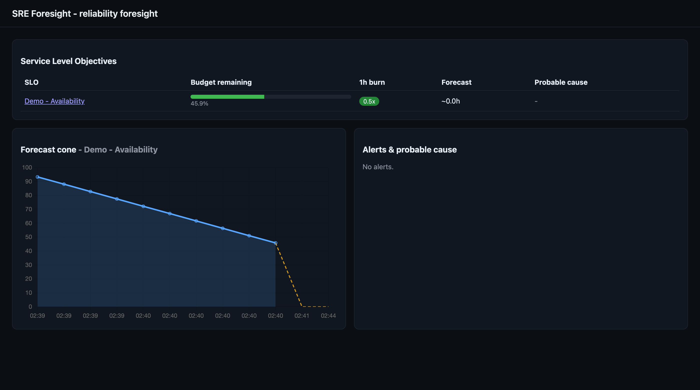
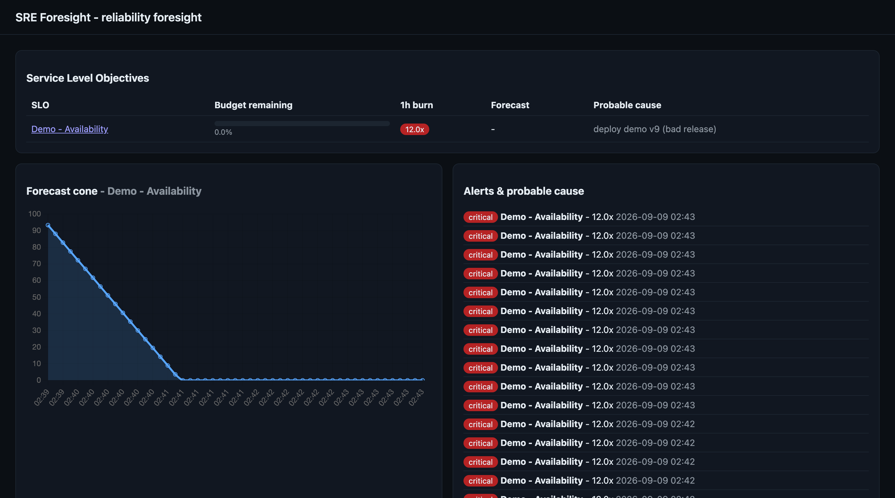

# SRE Foresight

[](https://github.com/ngatia/sre-foresight/actions/workflows/ci.yml)
[](LICENSE)

**Grafana tells you the house is on fire. SRE Foresight tells you which room
started it, how long until it burns down, and hands you the fire report while
you are still fighting it.**

SRE Foresight sits on top of your existing Prometheus-compatible metrics and
does the two things SLO dashboards do not:

1. **Forecasts error-budget exhaustion** - not just "burn rate is high right
   now," but "at this trend, the budget is gone in ~4h (range 2h to 7h)," with
   a confidence cone.
2. **Correlates burn spikes to the change that caused them** - it watches your
   deploys and pipelines and names the probable culprit, instead of leaving you
   to cross-reference timestamps by hand.

It reads any Prometheus-compatible source (self-hosted Prometheus, Mimir,
Thanos, Amazon Managed Prometheus, Grafana Cloud), runs as a single container,
and needs no database to get started.

> **Status:** v1 is merged. See [`CONTEXT.md`](CONTEXT.md) for the domain
> glossary and [`docs/adr/`](docs/adr) for the key design decisions.

## Demo

Run it yourself in about two minutes with [`make demo`](#try-the-demo), or see
it in action below. The demo drives a mock Prometheus whose SLI degrades over a
time-compressed arc and injects a `deploy` change event, so you can watch the
whole pipeline react.

**1. The error budget declines, and the exhaustion forecast projects when it hits zero (the cone):**



**2. The burn rate crosses critical, an alert fires, and it names the probable cause - the injected deploy:**



*(The demo is time-accelerated, so the forecast reads ~0h; against real metrics
the exhaustion horizon is typically hours to days.)*

## Why not just Grafana / Datadog / Nobl9?

Those tools show you the *current* burn rate and alert on thresholds, and they
do it well - keep using them. What they do not do: forecast *when* the budget
runs out, or tell you *which deploy* caused the spike. SRE Foresight is
complementary, not a replacement.

## Quick start

```bash
# 1. Declare your SLOs. config/slos.yaml is NOT shipped, copy the example first.
cp config/slos.example.yaml config/slos.yaml
# edit config/slos.yaml: point each metric_query at your own PromQL, set targets

# 2. Point the app at your Prometheus-compatible source.
cp .env.example .env
# edit .env: set PROMETHEUS_URL (and PROMETHEUS_TOKEN if it needs auth)

# 3. Run it.
docker compose up
# open http://localhost:8000
```

`docker-compose.yml` mounts `./config/slos.yaml` read-only into the container
and reads `PROMETHEUS_URL` from your shell environment (or `.env` in the repo
root, which Docker Compose loads automatically) - if you skip step 2 it falls
back to `http://prometheus:9090`, which will not resolve unless you also run a
service by that name on the same Compose network.

## How it works

Every SLO is evaluated on a fixed loop, once per `POLL_INTERVAL_SECONDS`
(default 60s), independently for each entry in `config/slos.yaml`:

1. **Query the SLI.** The SLO's `metric_query` (PromQL) is run against
   1-hour and 6-hour ranges on the configured Prometheus-compatible source, to
   get a recent "fraction good" ratio.
2. **Compute burn rate and budget.** The 1h and 6h ratios are converted into
   multi-window burn rates against `target_percent`, and the remaining error
   budget (as a percentage) is computed from the 6h window. Note: v1
   approximates error-budget-remaining from this recent rolling window (~6h),
   not the full declared `window_days` horizon; a fuller windowed budget over
   the whole `window_days` span is planned.
3. **Persist a sample.** The budget and burn rates are written to the
   `BurnRateSample` table, timestamped, so history accumulates run over run.
4. **Forecast exhaustion.** The last 24 samples for that SLO are fit with both
   a linear and an exponential-decay model (whichever fits better, by R^2);
   if the budget trend is downward, this yields a point estimate (and interval)
   of hours until the budget hits zero.
5. **On threshold, correlate and notify.** If the 1h burn rate crosses
   `warning_burn_rate` or `critical_burn_rate`, an `AlertEvent` is recorded,
   change events for that service in the last 30 minutes (see
   [Change events / webhook](#change-events--webhook) below) are scored by
   proximity to the spike and weighted toward deploys, and the closest match
   becomes the "probable cause." A notification is sent to any configured
   webhook and/or Slack webhook. On a **critical** alert, if `POSTMORTEM_DIR`
   is set, a Markdown postmortem draft is also written there.

The dashboard (served at `/`) and the read-only API poll the same state that
this loop produces - budgets, burn rates, forecasts, alerts, and the
correlated probable cause per SLO.

### Change events / webhook

Alert correlation only works if SRE Foresight knows about your deploys and
pipeline runs. Point your CI/CD or GitOps tool at the generic webhook:

```
POST /api/events
Content-Type: application/json

{
  "service": "checkout-api",
  "event_type": "deploy",
  "source": "argocd",
  "description": "deploy checkout-api v42",
  "timestamp": "2026-09-08T14:03:00Z",
  "metadata": {"revision": "abc1234"}
}
```

`event_type` must be `deploy` or `pipeline`. `service` must match the `service`
field of the SLO(s) you want it correlated against. `metadata` is optional and
stored as-is. The endpoint returns `202 Accepted` immediately; there is no
authentication on it (see [Security](#security)).

Two adapters can populate this automatically instead of a manual webhook call:
an optional in-cluster Kubernetes Deployment watcher
(`KUBERNETES_WATCH_ENABLED=true`) and an optional ArgoCD poller
(`ARGOCD_URL` + `ARGOCD_TOKEN`). Both are opt-in; the webhook always works
without either.

## Try the demo

```bash
make demo
```

This builds and starts a self-contained Compose stack (a mock Prometheus plus
the app, polling every 10s instead of 60s for a fast feedback loop), then
injects a burn (drops the mocked SLI) and a fake `deploy` change event. Watch
`http://localhost:8000`: the burn rate should spike, the forecast line should
bend toward exhaustion, and the alert's probable cause should name the
injected deploy. Stop and clean up with `make demo-down`.

> The demo binds unauthenticated endpoints to `localhost:8000` and
> `localhost:9090` - local use only, do not expose it.

## Configuration

SLOs are declared in YAML (see [ADR 0003](docs/adr/0003-declarative-yaml-slos.md)
and `config/slos.example.yaml` for the format: name, service, target_percent,
window_days, metric_query, and optional `alert_thresholds`). Metrics come from
any Prometheus-compatible source
([ADR 0001](docs/adr/0001-prometheus-as-sole-metrics-interface.md)). State lives
in SQLite by default, Postgres optionally
([ADR 0002](docs/adr/0002-sqlite-default-postgres-optional.md)).

Every `metric_query` is treated as a **good-ratio SLI**: it must return a value
in `[0,1]` (the fraction of events that were "good"). This applies to latency
SLOs too - express a latency SLO as a ratio query (the fraction of requests
faster than your threshold, e.g.
`sum(rate(..._bucket{le="0.5"}[5m])) / sum(rate(..._count[5m]))`), not as a raw
latency value. `threshold_seconds` is an optional advisory/display field only;
v1 does not compare any query against it, so keep the threshold inside the
ratio query itself.

`window_days` records the intended SLO horizon, but as noted in
[How it works](#how-it-works) v1 approximates the remaining error budget from a
recent rolling window rather than the full `window_days` span.

Everything below is set via environment variables (see `.env.example`) when
running directly or with `docker compose`, or via the equivalent Helm value
when deploying with the chart in `charts/sre-foresight`.

| Env var | Helm value | Default | Description |
|---|---|---|---|
| `PROMETHEUS_URL` | `prometheus.url` | `http://localhost:9090` | Prometheus-compatible query endpoint. Required for real use. |
| `PROMETHEUS_TOKEN` | via `secretEnv.PROMETHEUS_TOKEN` | unset | Bearer token for the Prometheus endpoint, if it requires auth. |
| `DATABASE_URL` | n/a - chart always uses the mounted SQLite path | `sqlite+aiosqlite:///./data/foresight.db` | SQLAlchemy async URL. Set to a `postgresql+asyncpg://...` URL to use Postgres instead. |
| `SLO_CONFIG_PATH` | n/a - chart always mounts the ConfigMap at `/app/config/slos.yaml` | `config/slos.yaml` | Path to the SLO YAML file. Not shipped by default - copy `config/slos.example.yaml` first. |
| `POLL_INTERVAL_SECONDS` | `pollIntervalSeconds` | `60` | Seconds between evaluations of each SLO. |
| `SLACK_WEBHOOK_URL` | via `secretEnv.SLACK_WEBHOOK_URL` | unset | Slack incoming webhook. When set, alerts also post a formatted Slack message. |
| `NOTIFY_WEBHOOK_URL` | via `secretEnv.NOTIFY_WEBHOOK_URL` | unset | Generic outgoing webhook. When set, alerts POST the notification as JSON. |
| `POSTMORTEM_DIR` | via `env.POSTMORTEM_DIR` (mount your own volume for it) | unset | Directory to write a Markdown postmortem draft into on critical alerts. |
| `KUBERNETES_WATCH_ENABLED` | via `env.KUBERNETES_WATCH_ENABLED` | `false` | Enable the in-cluster Kubernetes Deployment watcher. Needs RBAC to watch Deployments. |
| `ARGOCD_URL` | via `env.ARGOCD_URL` | unset | ArgoCD API base URL, for the optional ArgoCD deploy adapter. |
| `ARGOCD_TOKEN` | via `secretEnv.ARGOCD_TOKEN` | unset | ArgoCD API token, paired with `ARGOCD_URL`. |
| `ARGOCD_INSECURE` | via `env.ARGOCD_INSECURE` | `false` | Skip TLS verification against ArgoCD. Only for a self-signed homelab instance, never enable by default. |

Chart-only values (no env var equivalent, see `charts/sre-foresight/values.yaml`):

| Helm value | Default | Description |
|---|---|---|
| `image.repository` / `image.tag` | `ghcr.io/ngatia/sre-foresight` / chart `appVersion` | Image to deploy. |
| `imagePullSecrets` | `[]` | Pull secrets for a private registry. |
| `env` | `{}` | Extra plain (non-secret) env vars, merged into the container. |
| `secretEnv` | `{}` | Extra secret env vars (e.g. tokens/webhook URLs), rendered into a Kubernetes `Secret` and injected via `envFrom`. |
| `persistence.enabled` / `persistence.size` / `persistence.storageClass` | `true` / `1Gi` / `""` | PVC for the SQLite data directory. The chart hardcodes `DATABASE_URL` to that SQLite path and does not currently expose a Postgres override - use `docker compose` or a bare-metal run with `DATABASE_URL` set if you need Postgres. |
| `service.port` | `8000` | Service port. |
| `resources` | `100m/256Mi` requests, `500m/512Mi` limits | Container resource requests/limits. |
| `slos` | the example SLO | Rendered verbatim into the `slos.yaml` ConfigMap - replace with your real SLOs. |

## Security

SRE Foresight ships with no built-in authentication and binds internally by
default. This includes the `/api/events` webhook, which accepts unauthenticated
POSTs. Put it behind your own ingress and authorization layer before exposing
it (an authenticating reverse proxy, a service mesh policy, or a network
boundary that only your CI/CD and cluster can reach). This follows the same
convention as Prometheus and Alertmanager.

## License

[Apache-2.0](LICENSE)
